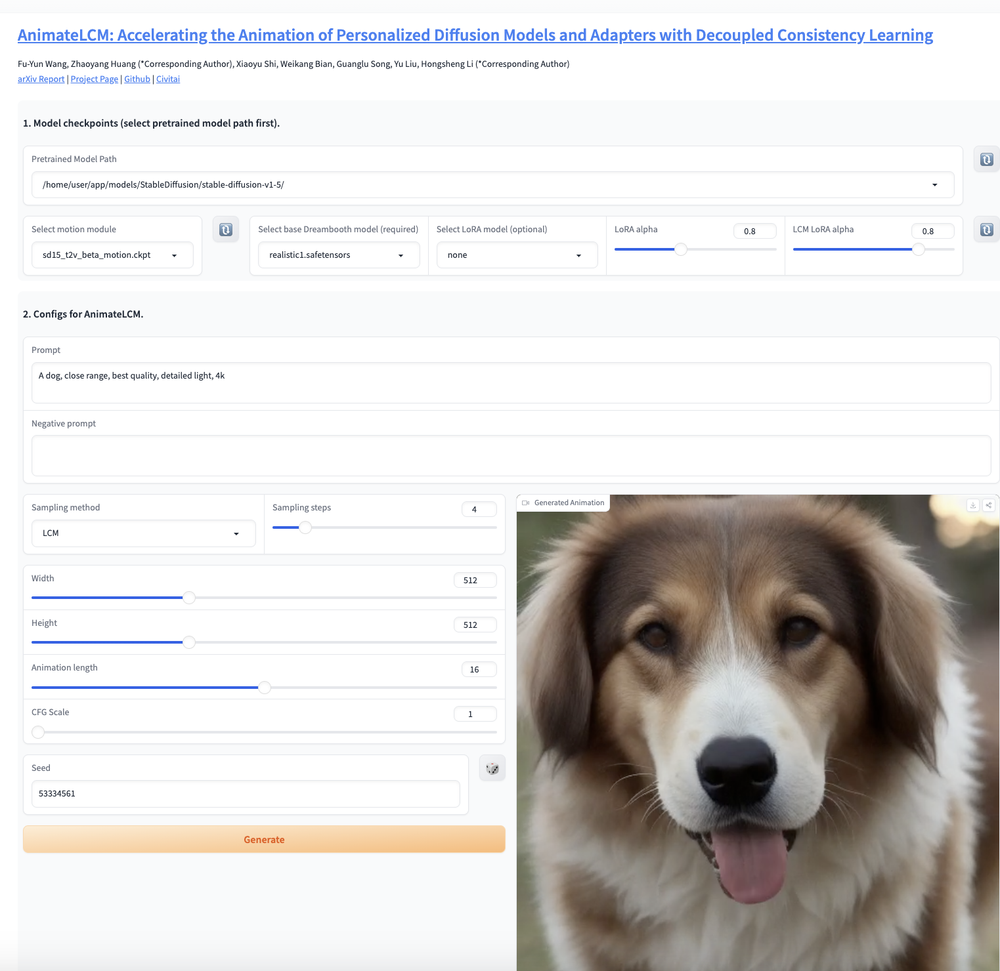

# AnimateLCM

[AnimateLCM: Accelerating the Animation of Personalized Diffusion Models and Adapters with Decoupled Consistency Learning](https://arxiv.org/abs/2402.00769)

Thank you all for your attention. For more details, please refer to our [Project Page](https://animatelcm.github.io/) and [HuggingFace Demo](https://huggingface.co/spaces/wangfuyun/AnimateLCM). 

    

Code and weights will be released.

