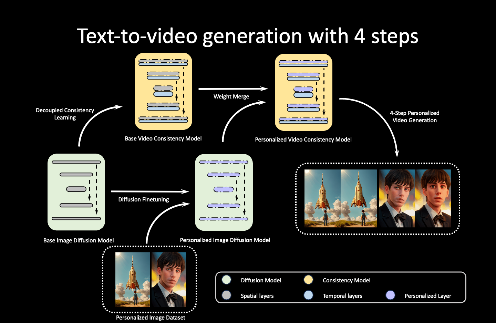
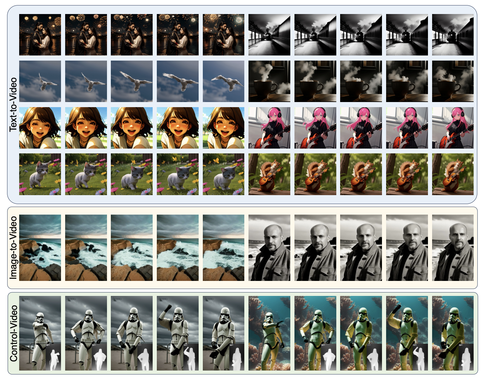
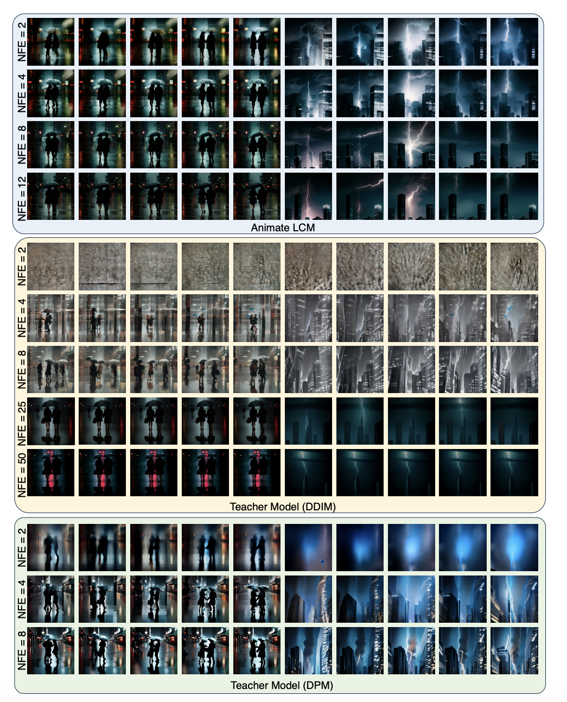

<div align="center">

## ⚡️AnimateLCM: Accelerating the Animation of Your Personalized Models and Adapters through Decoupled Consistency Learning

[[Paper]](https://arxiv.org/abs/2402.00769) [[Project Page ✨]](https://animatelcm.github.io/) [[Demo in 🤗Hugging Face]](https://huggingface.co/spaces/wangfuyun/AnimateLCM-SVD) [[Pre-trained Models]](https://huggingface.co/wangfuyun/AnimateLCM) [[Civitai]](https://civitai.com/models/290375/animatelcm-fast-video-generation)

by *[Fu-Yun Wang](https://g-u-n.github.io), Zhaoyang Huang📮, Xiaoyu Shi, Weikang Bian, Guanglu Song, Yu Liu, Hongsheng Li📮* 

</div>


If you use any components of our work, please cite it.

```
@article{wang2024animatelcm,
  title={AnimateLCM: Accelerating the Animation of Personalized Diffusion Models and Adapters with Decoupled Consistency Learning},
  author={Wang, Fu-Yun and Huang, Zhaoyang and Shi, Xiaoyu and Bian, Weikang and Song, Guanglu and Liu, Yu and Li, Hongsheng},
  journal={arXiv preprint arXiv:2402.00769},
  year={2024}
}

```

> Planning to release a v2 version of AnimateLCM-T2V. Here is a live recording of usage. 

Prompt:"river reflecting mountain"


### Introduction

Consistency model is a promising new family of generative models for fast yet high-quality generation, proposed by Professor [Yang Song](https://yang-song.net/). 

Animate-LCM is **a pioneer work** and exploratory on fast animation generation following the consistency models, being able to generate animations in good quality with 4 inference steps. 

It relies on the **decoupled** learning paradigm, firstly learning image generation prior and then learning the temporal generation prior for fast sampling, greatly boosting the training efficiency.

The High-level workflow of AnimateLCM can be


<div align="center">
  
</div>


### Demos

We have **launched lots of demo videos generated by Animate-LCM on the [Project Page](https://animatelcm.github.io/)**. Generally speaking, AnimateLCM works for fast, text-to-video, control-to-video, image-to-video, video-to-video stylization, and longer video generation. 


<div align="center">
  
</div>


### Models 

So far, we have released three models for usage

- [Animate-LCM-T2V](https://huggingface.co/wangfuyun/AnimateLCM): A spatial LoRA weight and a motion module for personalized video generation. Some trying from the community point out that the motion module is also compatible with many personalized models tuned for LCM, for example [Dreamshaper-LCM](https://civitai.com/models/4384?modelVersionId=252914).  

- [AnimateLCM-SVD-xt](https://huggingface.co/wangfuyun/AnimateLCM-SVD-xt). I provide AnimateLCM-SVD-xt and AnimateLCM-SVD-xt 1.1, which are tuned from [SVD-xt](https://huggingface.co/stabilityai/stable-video-diffusion-img2vid-xt) and [SVD-xt 1.1](https://huggingface.co/stabilityai/stable-video-diffusion-img2vid-xt-1-1) respectively. They work for high-resolution image animation with 25 frames with 1~8 steps. You can try it with the Hugging Face [Demo](https://huggingface.co/spaces/wangfuyun/AnimateLCM-SVD). Thanks to the Hugging Face team for providing the GPU grants. 

- [AnimateLCM-I2V](https://huggingface.co/wangfuyun/AnimateLCM-I2V). A spatial LoRA weight and a motion module with an additional image encoder for personalized image animation. It is our trying to directly train an image animation model for fast sampling without any teacher models. It can generate animations with a personalized image with 2~4 steps. Yet due to the training resources is very limited, it is not as stable as I would like (Just like most I2V models built on Stable-Diffusion-v1-5, they generally not very stable for generation).

### Install & Usage Instruction

We split the animatelcm_sd15 and animatelcm_svd into two folders. They are based on different environments. Please refer to [README_animatelcm_sd15](./animatelcm_sd15/README.md) and [README_animatelcm_svd](./animatelcm_svd/README.md) for instructions.
 
### Usage Tips

- **AnimateLCM-T2V**: 
    - 4 steps can generally work well. For better quality, apply 6~8 inference steps to improve the generation quality.
    - CFG scale should be set between 1~2. Set CFG=1 can reduce the sampling cost by half. However, generally, I would prefer using CFG 1.5 and setting proper negative prompts for sampling to achieve better quality.
    - Set the video length to 16 frames for sampling. This is the length that the model trained with.   
    - The models should work with IP-Adapter, ControlNet, and lots of adapters tuned for Stable Diffusion in a zero-shot manner. If you hope for better results of combination, you can try to tune them together by applying the teacher-free adaptation script I provide. It will not corrupt the sampling speed. 

- **AnimateLCM-I2V**:
    - 2-4 steps should work for personalized image animation. 
    - In most cases, the model does not need CFG values. Just set the CFG=1 to reduce inference cost.
    - I additionally set a `motion scale` hyper-parameter. Set it to 0.8 as the default choice. If you set it to 0.0, you should always obtain static animations. You can increase the motion scale for larger motions, but that will sometimes cause generation failure.

    - The typical workflow can be:
        - Using your personalized image models to generate an image with good quality.
        - Applying the generated image as input and reusing the same prompt for image animation.
        - You can even further apply AnimateLCM-T2V to refine the final motion quality.

- **AnimateLCM-SVD**: 
    - 1-4 steps should work.
    - SVD requires two CFG values. `CFG_min` and `CFG_max`. By default, `CFG_min` is set to 1. Slightly adjusting `CFG_max` between [1, 1.5] will obtain good results.  Again, just setting it to 1 to reduce the inference cost.
    - For other hyper-parameters of AnimateLCM-SVD-xt, please just follow the original SVD design.

### Related Notes

- 🎉 Tutorial video of AnimateLCM on ComfyUI: [Tutorial Video](https://www.youtube.com/watch?v=HxlZHsd6xAk&feature=youtu.be)
- 🎉 ComfyUI for AnimateLCM: [AnimateLCM-ComfyUI](https://github.com/dezi-ai/ComfyUI-AnimateLCM) & [ComfyUI-Reddit](https://www.reddit.com/r/comfyui/comments/1ajjp9v/animatelcm_support_just_dropped/) 


### Comparison

Live recording of AnimateLCM-T2V. Prompt: "dog with sunglasses".


<div align="center">
  
</div>


### Contact & Collaboration

I am open to collaboration, but not to a full-time intern. If you find some of my work interesting and hope for collaboration/discussion in any format, please do not hesitate to contact me.

📧 Email: fywang@link.cuhk.edu.hk

### Acknowledge

I would thank **[AK](https://twitter.com/_akhaliq)** for broadcasting our work and the hugging face team for providing help in building the gradio demo and storing the models. Would thank the [Dhruv Nair](https://twitter.com/_DhruvNair_) for providing help in diffusers.


